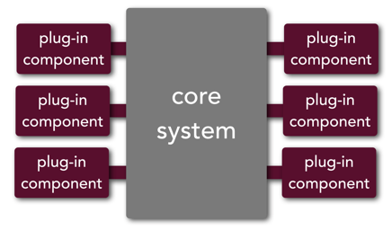
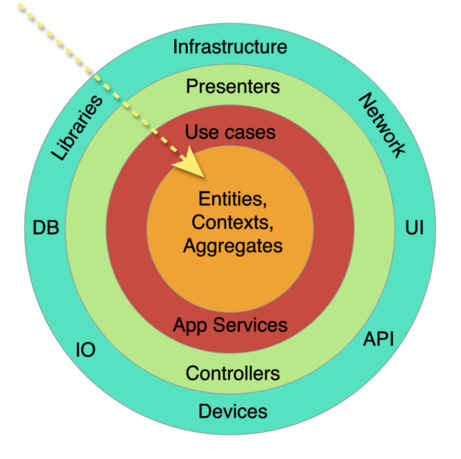

This project was generated with Angular CLI version 8.3.23.

#### MicroKernels

El patrón arquitectónico *MicroKernels* (algunas veces llamado arquitectura plug-in) divide la lógica en dos (2) partes:




- **Core**: Agrupa sólo el código estrictamente necesario para que funcione el sistema con cada uno de sus módulos, lo que sería el código común.
- **Característica ó Módulo ó Feature**: Agrupa el código relacionado a un solo módulo. El cual debe ser totalmente independiente de otro Módulo.

Bajo este patrón se reduce el impacto de un cambio en una característica, puesto que una característica tiene que ser independiente de la otra. Necesariamente esto implica un cierto nivel controlado de repetición de código.

A nivel de organización de los archivos del proyecto, se refleja una estructura de carpetas y archivos acorde a la teoría, en el nivel mas alto la estructura es:

```bash
├── core
│   └── core.module.ts
└── features
    ├── feature-1
    │   └── feature-1.module.ts    
    └── feature-n
		└── feature-n.module.ts 
```


#### Clean Architecture

El patrón arquitectónico *Clean Architecture* es un patrón basado en capas, donde el código se modela partiendo del criterio en que las capas inferiores no son conscientes de los detalles de las capas superiores.

En esta primera ilustración se observa una estructura bastante general y posiblemente mas orientada a backend, que si bien es referencial, no se ajusta perfectamente a lo que se plantea para angular.




Se consideraron las siguientes capas en orden descendente (de mas externo a mas interno):

1. **UI**: Abarca todo el código en los archivos de extensión HTML y CSS, comprende todo el código necesario para visualizar la interfaz de usuario con la mínima lógica prestacional posible.
2. **Controlador**: Abarca los archivos .ts de cada componente angular, debe incluir sólo la lógica necesaria para renderizar la interfaz, delegando el procesamiento al presenter. Tanto el controlador como el presenter están en la misma capa por lo tanto pueden acceder uno a otro y se conocen a través de sus atributos públicos.
3. **Presenter**: Abarca la lógica de presentación, inicialización de variables y control de flujos de interfaz de usuario. Tanto el controlador como el presenter están en la misma capa por lo tanto pueden acceder uno a otro y se conocen a través de sus atributos públicos.
   1. Incluye clases para formularios, clases para controles de formularios, clases para validaciones, comandos para inicializaciones complejas posiblemente de formularios dinámicos.
   2. Incluye servicios para comunicación o sincronización entre componentes
   3. Cualquier otra lógica que corresponda a esta capa
4. **Dominio**: Abarca la lógica de negocio y casos de uso, en el caso puntual del front, abarca los modelos, adaptadores y servicios de dominio encargado de procesar los datos necesarios para el **FrontEnd** de forma tal que los modelos sean lo mas independientes posible de la estructura de datos expuesta por los servicios del **BackEnd**.
   1. Modelos: Los modelos son interfaces y/o tipos de datos, que constituyen las estructuras utilizadas tanto por esta capa como por las capas superiores, lo cual rompe un poco la idea de la arquitectura, pero resulta fundamental para aprovechar las bondades del tipado y para blindar al front de cambios en las entidades
   2. Adaptadores a modelos: Encapsula la lógica de construir un modelo válido para toda la lógica de esta y las capas superiores.
   3. Builders: Encapsula lógica compleja para construir tanto modelos como entidades, cuya estructura seguramente refleja necesidades abstractas de un endpoint y existe un esfuerzo considerable en construirla a partir de todo lo que se tenga en las vistas.
5. **Repositorio**: Abarca las entidades (modelos del **BackEnd**) y servicios de repositorios encargados de comunicarse con el backend.
   1. Entidades: Las entidades son interfaces y/o tipos de datos, que constituyen las estructuras utilizadas sólo en esta capa, reflejando aquellas manejadas por el backend, resulta fundamental para aprovechar las bondades del tipado.
   2. Adaptadores a entidades: Encapsula lógica compleja para construir una entidad válida, para la lógica de esta capa, que básicamente sería enviar el body en el request que se haga al backend.

A nivel de carpetas, se consideran una carpeta por cada capa (algunos módulos no tienen ciertas capas por lo cual se puede omitir la carpeta, sin embargo no me he encontrado con un caso de uso donde no haya una capa de dominio):

```bash
├── feature-n
    │ feature-n.module.ts
    | feature-n.routing.ts (optional)
    | feature-n.component.ts
    | feature-n.component.html
    | feature-n.component.scss
    ├── commons
    │   ├── components
    |   |    ├── feature-n-components.module.ts
    |   |    └── functionality-n-component
    |   |        ├── functionality-n-component.ts
    |   |        ├── functionality-n-component.html
    |   |        └── functionality-n-component.scss
    │   ├── presenters
    |   |    ├── feature-n-presenter.module.ts
    |   |    ├── component-n.presenter.service.ts
    |   |    └── funtionality-n.service.ts
    │   ├── domain
    |   |    ├── feature-n-domain.module.ts
    |   |    └── front-context-n
    |   |        ├── front-context-n.domain.service.ts
    |   |        ├── model-n.model.ts
    |   |        └── model-n.adapter.model.ts (optional)
    │   └── repository
    |       ├── feature-n-repository.module.ts
    |       └── context-n
    |			├── context-n.repository.service.ts
    |         	 ├── entity-n.entity.ts (optional)
    |         	 └── entity-n.adapter.entity.ts (optional)
    └── views
    	└── view-n
             ├── feature-n-view-n.component.ts
             ├── feature-n-view-n.component.html
             └── feature-n-view-n.component.scss

```


En este esquema se aprecian algunas carpetas correspondientes al patrón arquitectónico *Clean Architecture*, con algunas modificaciones para mejorar la estructura:

- **views**: Contiene las vistas del módulo, en caso de que agrupe funcionalidades complejas o que ameriten una separación. Por lo general sólo hay un componente en esta carpeta.
- **commons**: Contiene las carpetas para cada una de las capas del patrón arquitectónico *Clean Architecture*.
  - **components**: Contiene los componentes necesarios para todas las vistas del módulo, subdivididos de acuerdo a una funcionalidad mas específica (como por ejemplo, ver los detalles de una transacción, barra de búsqueda, componente modal para agregar/modificar, entre otros). Cada componente incluye tres (3) archivos:
    - ***.component.html**: Código *HTML* para visualizar el componente.
    - ***.component.scss**: Código *SCSS* para estilizar el componente.
    - ***.component.ts**: Código *Typescript* correspondiente al Controlador del componente.
  - **presenters**: Contiene los archivos .ts correspondientes a cada *presenter* de cada componente que requiera un presenter.
    - ***.presenter.service.ts**: Código *Typescript* correspondiente a un *presenter* para un componente.
  - **domain**: Contiene los archivos .ts correspondientes a una parte de los casos de uso o modelado de las reglas de negocio.
    - ***domain.service.ts**: Código *Typescript* correspondiente al dominio de un componente, se encarga de obtener los datos (en la gran mayoría de los casos son requeridos a la capa de repositorio y transformados).
    - ***.model.ts**: Código *Typescript* correspondiente al modelado interno (de **FrontEnd**) para una clase, en la mayoría de los casos esta relacionada a una *Entidad*. Sin embargo se trata de modelos internos del **FrontEnd** por lo que no necesariamente debe estar relacionado a una *Entidad*.
    - ***.adapter.model.ts**: Código *Typescript* correspondiente a la conversión de una entidad a un modelo a través del patrón adaptador. Generalmente son usadas en *decoradores*, ó lógica reactiva, a la hora de llamar a la capa de repositorio, de modo que se aseguren modelos válidos en el **FrontEnd**. 
  - **repository**: Contiene los archivos .ts correspondientes a la capa de repositorio de cada componente que requiera acceder a la capa de repositorio.
    - ***repository.service.ts**: Código Typescript correspondiente al repositorio de un componente, se encarga de obtener los datos directamente desde el backend a través de una instancia de HttpClient provista por la inyección de dependencias de **Angular**.
    - ***.entity.ts**:  Código Typescript correspondiente al modelado de los objetos y respuestas establecidas en cada uno de los contratos (o también empíricamente) de los servicios que son consumidos en **FrontEnd**.
    - ***.entity.adapter.ts**: Código Typescript correspondiente a la conversión de un modelo interno del **FrontEnd** hacia un modelo usado por un servicio. Solo se declaran en casos donde la conversión es compleja y no conviene colocarla directamente en el servicio de dominio.